# medchat

A retrieval-augemented generation (RAG) Q/A chatbot designed for use with medical journal articles.


## Documentation

Detailed documentation for this project is located in the `./documentation/` folder. Below is a brief overview of the contents of each file:

- **`database.md`**: Describes the database schema, including tables, relationships, and fields used to store application data.
- **`language_models.md`**: Provides details about the language models used in the pipeline, including their roles and configurations.
- **`text_extraction.md`**: Documents the process of extracting and preprocessing text from source documents for processing.
- **`text_processing.md`**: Covers the source text processing steps (chunking and vectorization).
- **`rag_pipeline.md`**: Explains the retrieval-augmented generation pipeline, detailing how context is retrieved and responses are generated.
- **`evaluation.md`**: Outlines the evaluation methodology for the RAG system, including user interaction metrics and controlled testing metrics.

In addition to the markdown files, the `./notebooks/` folder contains some jupyter notebooks that go into detail on some of these processes with running code examples. The markdown files will point you the relevant notebooks.

## Requirements

- Docker
- Docker Compose
- [Nvidia Container Toolkit](https://docs.nvidia.com/datacenter/cloud-native/container-toolkit/latest/install-guide.html) and Nvidia GPU with at least 5-6GB of VRAM.
- [Git LFS](https://git-lfs.com/) (for downloading models from huggingface)

> [!NOTE]: you can try running all models on CPU if you do not have access to cuda kernels but latency may become unusable.

## Getting Started

1. **.env Setup**

    Create a `.env` file at the root of this repo and add the password you want to use for your database, example:
    ```toml
    POSTGRES_PASSWORD="p@$$w0rd"
    ```
2. **Download Language Models**

    This app uses a total of 4 language models:
    * **[MedCPT-Query-Encoder](https://huggingface.co/ncbi/MedCPT-Query-Encoder)**: generates embeddings from user queries.
    * **[MedCPT-Article-Encoder](https://huggingface.co/ncbi/MedCPT-Article-Encoder)**: generates embeddings for article chunks.
    * **[MedCPT-Cross-Encoder](https://huggingface.co/ncbi/MedCPT-Cross-Encoder)**: a cross-encoder model that ranks  chunks based on relevance to the query.
    * [**Qwen3-4b-AWQ**](https://huggingface.co/Qwen/Qwen3-4B-AWQ): text generation model

    Download local copies of each model and save them in your `./models/` directory. For example,
    ```bash
    git lfs install
    git clone https://huggingface.co/Qwen/Qwen3-4B-AWQ
    ```

3. **Add Sources**

    Add any pdfs you want to upload to the `./sources/` directory. These will be ingested during app startup.

    >Note that the app is currently configured to get the best possible text extraction from `./sources/SlamonetalSCIENCE1987.pdf` (default source).
    >
    >If you wish you analyze other sources you may need to adjust some of the text extraction parameters. See `./documentation/text_extraction.md` for details.


4. **Start the application**

    From a terminal at the root of this repo run `docker compose up --build`. You only need the `--build` flag the first time you start the app.

    Note that building the images may take a while as the backend image is quite large.

5. **Access Frontend**

    Navigate to `http://localhost:8501/`.

6. **(Optional) Inspect DB with Adminer**

    Navigate to `http://localhost:8080/` and login with username `postgres` and the password you set in you `.env` file.

## Container Architecture

This app consists of a total of 5 docker containers which are launched together using the docker compose file.

1. **Backend (medchat-backend)** 

    Hosts the backend API using FastAPI. It handles the core application logic, processes requests, and interacts with the database.

2. **Frontend (medchat-frontend)**

    Provides the user interface using Streamlit. It serves as the entry point for users to interact with the application.

3. **Database (medchat-db)**

    Stores relational data using PostgreSQL. It acts as the persistent storage layer for the application and the vector database for context retrieval via the PgVector extension.

4. **Adminer (adminer)**

    Provides a web-based database management interface for PostgreSQL. Useful for developers or admins to manage and query the database without having to install pgAdmin or similar.

5. **Blob Server (blob-server)**

    Serves source pdfs for the frontend using an HTTP server. Allows users to open pdf files in browser when interacting with the frontend.


### Container Diagram

- 📦 = Container/Service
- 🔌 = Ports
- 📂 = Volume Mounts

```mermaid
flowchart LR
    %% Containers with Ports
    Backend(["📦 medchat-backend
    FASTAPI
    🔌 5050:5050"])
    Frontend(["📦 medchat-frontend
    STREAMLIT
    🔌 8501:8501"])
    DB(["📦 medchat-db
    POSTGRES
    🔌 5432:5432"])
    Adminer(["📦 adminer
    ADMINER
    🔌 8080:8080"])
    Blob(["📦 blob-server
    HTTP-SERVER
    🔌 9090:9090"])

    %% Volumes
    Sources(["📂 ./sources"])
    LogsBackend(["📂 ./logs/backend"])
    LogsFrontend(["📂 ./logs/frontend"])
    Models(["📂 ./models"])
    SrcBackend(["📂 ./src/backend"])
    SrcFrontend(["📂 ./src/frontend"])
    PGData(["📂 ./databases/pgdata"])

    %% Dependencies
    Backend -->|depends_on| DB
    Frontend -->|depends_on| Backend
    Frontend -->|serves files from| Blob
    Adminer -->|connects to| DB

    %% Volume Mounts
    Backend --- Sources
    Backend --- LogsBackend
    Backend --- Models
    Backend --- SrcBackend

    Frontend --- LogsFrontend
    Frontend --- SrcFrontend

    DB --- PGData
    Blob --- Sources
```

