# medchat

A retrieval-augemented generation (RAG) Q/A chatbot designed for use with medical journal articles.

The complete pipeline for this application is outlined briefly below and described in greater detail in the `notebooks/` folder, which contains a series of Jupyter notebooks documenting the development and logic of each stage. Note that while the code in the `src` may differ slightly from that in the notebooks (to integrate with the broader application structure) the code in the notebooks is functionally the same as what is powering the app.


## Requirements

- Docker
- Docker Compose
- [Nvidia Container Toolkit](https://docs.nvidia.com/datacenter/cloud-native/container-toolkit/latest/install-guide.html) 
- **Optional**: [Git LFS](https://git-lfs.com/) (for downloading models from huggingface)


## Container Architecture

- 📦 = Container/Service
- 🔌 = Ports
- 📂 = Volume Mounts

```mermaid
flowchart LR
    %% Containers with Ports
    Backend(["📦 medchat-backend
    🔌 5050:5050"])
    Frontend(["📦 medchat-frontend
    🔌 8501:8501"])
    DB(["📦 medchat-db
    🔌 5432:5432"])
    Adminer(["📦 adminer
    🔌 8080:8080"])
    Blob(["📦 blob-server
    🔌 9090:9090"])

    %% Volumes
    Sources(["📂 ./sources"])
    LogsBackend(["📂 ./logs/backend"])
    LogsFrontend(["📂 ./logs/frontend"])
    Models(["📂 ./models"])
    SrcBackend(["📂 ./src/backend"])
    SrcFrontend(["📂 ./src/frontend"])
    PGData(["📂 ./databases/pgdata"])

    %% Dependencies
    Backend -->|depends_on| DB
    Frontend -->|depends_on| Backend
    Frontend -->|serves files from| Blob
    Adminer -->|connects to| DB

    %% Volume Mounts
    Backend --- Sources
    Backend --- LogsBackend
    Backend --- Models
    Backend --- SrcBackend

    Frontend --- LogsFrontend
    Frontend --- SrcFrontend

    DB --- PGData
    Blob --- Sources



```




## Database


## Downloading Models from Huggingface

Example for Qwen3-4B-AWQ:

1. Find model on HuggingFace: https://huggingface.co/Qwen/Qwen3-4B-AWQ
2. Run the following commands (updated with your model's url) from a the models directory:
    ```bash
    git lfs install
    git clone https://huggingface.co/Qwen/Qwen3-4B-AWQ
    ```