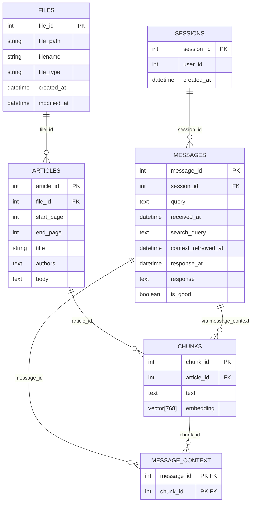

# Database

This app uses PostgreSQL, , running locally within a Docker container, as its relational database. We chose PostgreSQL because it is feature rich, production-ready, and open-source. Moreover, with the PgVector extension, PostgreSQL doubles as a vector store for fast context retrieval. This simplifies our architecture by eliminating the need for an additional service.

## Setup

The PostgreSQL data directory is mounted to the host machine at: `databases/pgdata` to allow persistence across container restarts and updates.

To facilitate flexibility, the app uses **SQLAlchemy** as its database ORM. This allows you to easily switch to other database types (e.g., to a managed SQL service) by updating the connection parameters in `src/backend/config.toml`. Note, if you are switching to a non-postgres database, you will need to add an additional vector store service and re-implement the indexing and retrieval functions.

## Table Descriptions

- **FILES**: represent individual pdf files and their metadata including path, name, type, and created/modified timestamps.
- **ARTICLES**: represent individual articles extracted from a file and store article-level metadata like page ranges, titles, and authors.
- **CHUNKS**: represent smaller segments of articles and their vector embeddings. Embeddings are indexed using PgVector for efficient retrieval (see below).
- **SESSIONS**: represent chat sessions with each session linked to multiple **MESSAGES** representing queries and responses.
- **MESSAGES**: represent user queries and responses. Store the original query, generated search query, model's response, timestamps for received and response times, and feedback flag.
- **MESSAGE_CONTEXT**: Links messages to the context chunks retrieved and used in the response. This many-to-many relationship allows messages to be associated with multiple chunks and vice versa.

## Embedding Indexing with PgVector

To enable efficient similarity search over chunk embeddings, the app uses the PgVector extension in PostgreSQL to store and index vector data directly in the database.

Each chunk of text in the `chunks` table includes a 768-dimensional embedding vector. To accelerate nearest-neighbor search, we define an approximate vector index using the **HNSW** (Hierarchical Navigable Small World) algorithm. 

### Index Details

```python
# SQLAlchemy code snippet
Index(
    "idx_chunk_embedding",
    "embedding",
    postgresql_using="hnsw",
    postgresql_with={"m": 16, "ef_construction": 64},
    postgresql_ops={"embedding": "vector_cosine_ops"},
)
```

- **Indexing Algorithm**: `hnsw` — an efficient, graph-based approximate nearest neighbor algorithm; it is the standard choice for many popular vector databases.
- **Distance Metric**: `vector_cosine_ops` — uses cosine similarity to measure distance between vectors.
- **HNSW Parameters**:
    - `m=16`: maximum the number of bidirectional (same layer) edges created for each node in the HNSW graph. Higher values improve recall at the cost of index size and insert/build time.
    - `ef_construction=64`: Determines the number of candidate nodes considered during index construction. Larger values lead to more thorough search for the best connections, at the cost of insert/build time.

Note, I did not tune the HNSW parameters (just left them at their default values) but this could be done by utilizing the evaluation approach outlined in `documentation/evaluation.md`.

## ER Diagram
