# Retrieval Augmented Generation (RAG) Pipeline

This application uses a Retrieval-Augmented Generation (RAG) pipeline to generate reliable, context-aware responses to user queries. 

## Step-by-Step Breakdown

For details on why we selected the models used for each step see `language_models.md`.

1. **User Query**

   A user submits a query to the system.

2. **Generate Search Query**

   Qwen3-4b (with thinking *off*) reformulates the query to improve retrieval performance. 
   
   This is particularly important for multi-message chats where the user's last message may not contain enough information to find relevant results. Example:
   ```
    👤 : What is HER-2/neu?
    🤖: HER-2/neu is an oncogene in the erbB family. It plays a critical role in breast cancer biology, influencing tumor progression and survival outcomes.
    👤 : What's its correlation to survival and relapse risk?
   ```

3. **Embed Query**

   The refined query is passed through the **MedCPT Query Encoder**, which produces a 768-dimensional vector embedding. 

4. **Vector Search**

   The query embedding is used to perform a nearest-neighbor search against the `chunks` table in PostgreSQL using **PgVector** and HNSW indexing. This efficiently retrieves semantically relevant content.

   You configure the maximum number of returned chunks and the maximum distance for returned chunks in the `src/backend/config.toml` file. By default, we set them to
   - `MAX_CHUNKS_COSINE_SEARCH` = 10
   - `MAX_CHUNK_COSINE_DISTANCE` = 0.5

   We suggest keeping the number of chunks returned at this step relatively *large* as the list will be further refined at the next step.

5. **Rerank Chunks**

   Retrieved chunks are reranked using the **MedCPT Cross Encoder**, which scores query-chunk pairs to improve relevance and filter noise.

   As before, you configure the maximum number of returned chunks and the minimum relevance score for returned chunks in the `src/backend/config.toml` file. By default, we set them to
   - `MAX_CHUNKS_CROSSENCODER` = 3
   - `MIN_CHUNK_CROSSENCODER_RELAVANCE` = 5.0

   We suggest keeping the number of chunks returned at this step relatively *small* since providing irrelevant information may confuse the model and increase response latency.

6. **Generate Response**

   The top-ranked chunks and the search query are sent to **Qwen3-4b** (with thinking *on*) to generate a natural language response grounded in the retrieved context.

7. **Log Message**

   The query, search metadata, context chunks, and generated response are stored in PostgreSQL for traceability and future analysis.

8. **Return Response and Solicit Feedback**

   A structured response is returned to the user, including the final answer the supporting context. On the frontend, the user can optionally provide binary positive/negative feedback which is also logged in the database.


### Benefits

* **Efficiency**: Dense retrieval with approximate search ensures fast response times, even with large document sets.
* **Modularity**: Each model component (query encoder, reranker, generator) is independently swappable for easier experimentation and upgrades.
* **Transparency**: All queries and responses are logged with context, supporting auditability and user feedback.
* **Simplicity**: By leveraging PgVector within PostgreSQL, we avoid the complexity of deploying a separate vector store.


## Flowchart

```mermaid
flowchart TD
    %% Main Pipeline Steps
    A[1️⃣ User Query] --> B[2️⃣ Generate Search Query]
    B --> C[3️⃣ Embed Query]
    C --> D[4️⃣ Vector Search]
    D --> E[5️⃣ Rerank Chunks]
    E --> F[6️⃣ Generate Response]
    F --> H[7️⃣ Log Response]
    H --> G[8️⃣ Return ChatResponse]

    %% External Systems (Databases and Models)
    subgraph DBs
        PG[(Postgres DB
        with PgVector)]
    end

    subgraph Models
        QWEN{{Qwen3 4b -- AWQ}}
        QENC{{MedCPTQuery Encoder}}
        CENC{{MedCPT Cross Encoder}}
    end

    %% Data Flow to Models (Dashed)
    B <-.->|use| QWEN
    C <-.->|use| QENC
    E <-.->|use| CENC
    F <-.->|use| QWEN

    %% Data Flow to Databases (Dashed)
    H <-.->|Log Response| PG
    D <-.->|Query Embedding| PG

    %% Styling
    classDef step fill:#bbf,stroke:#000,stroke-width:1px;
    classDef db fill:#ffe0b2,stroke:#a66,stroke-width:1.5px;
    classDef model fill:#dcedc8,stroke:#4caf50,stroke-width:1.5px,font-style:italic;

    class A,B,C,D,E,F,G,H step;
    class PG,VDB db;
    class QENC,CENC,QWEN model;
```

